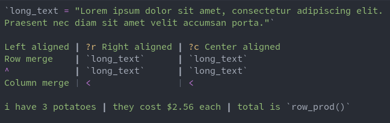
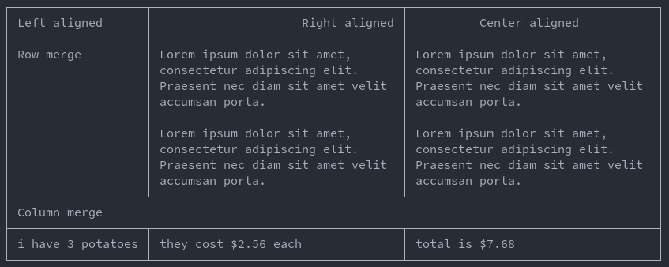

# tablescript
A simple yet powerful language for generating text-based tables.

Supports:
* Word wrap
* Column merging
* Row merging
* Text alignment (vertical and horizontal)
* Text padding
* Border theming
* Python scripting

## Why?
I take notes in vim, and vim is text-based.
If I want a table in my notes, it's very tedius to create one by hand.
This script allows me to create and edit powerful tables easily and quickly.

## Syntax

### Separating
Columns are separated by `|` characters, and rows by newlines.

### Merging
Column merging is denoted with `<` at the start of a cell.

Row merging is denoted with `^` at the start of a cell.

### Configuring
A cell can be configured by with a `?` at the start of a cell. Any characters after, until whitespace or a separator, will be parsed as configuration options.
The configuration options are as follows:
* `l`: left alignment
* `c`: center alignment
* `r`: right alignment
* `t`: top alignment
* `m`: middle alignment (vertical center alignment)
* `b`: bottom alignment
* a number followed by `R`: right padding
* a number followed by `L`: left padding
* `j`: vertically join cell (do not draw separator between this cell and cell above it)
* `s`: separate cell (opposite of join)
* `d`: use default configuration.
* a number followed by `B`: change the border and corner style.
* a number followed by `C`: change the corner style.

As well as this, the character `>` will apply the configuration to subsequent cells in the current row, while `v` will apply the configuration to  all subsequent cells in the current column. Think of the characters as pointing in the direction of where the configuration will apply. The characters can be combined `>v` or `v>` to apply to both rows and columns.

### Scripting
Tablescript can run python code contained between a pair of backticks (\`).
Some functions have been provided, including:
* `row_sum(n=0)`: Return the sum of entire row if n=0, otherwise sum n columns left.
* `row_prod(n=0)`: Return the product of entire row if n=0, otherwise product of n columns left.
* `row(n)`: Return the value n rows up in the current column.
* `col_sum(n=0)`: Return the sum of entire column if n=0, otherwise sum n rows up.
* `col_prod(n=0)`: Return the product of entire column if n=0, otherwise product of n rows up.
* `col(n)`: Return the value n columns left in the current row.
* `money(n)`: convert a number into a Money datatype.

Values used in these functions are found using a regex, and so number can be contained in the middle of strings.
Furthermore, if a number begins with a `$`, it will be converted into a Money datatype, which makes formatting easier.
